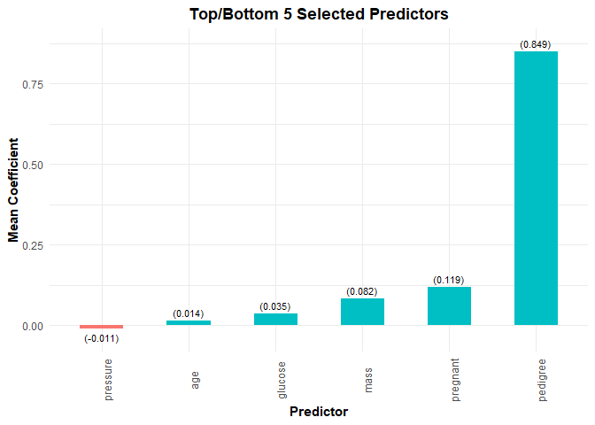

<!-- README.md is generated from README.Rmd. Please edit that file -->

``` r
knitr::opts_chunk$set(
  collapse = TRUE,
  comment = "#>",
  fig.path = "man/figures/README-",
  out.width = "100%"
)
```

# bolasso <a href='dmolitor.github.io/bolasso/'></a>

<!-- badges: start -->

[](https://lifecycle.r-lib.org/articles/stages.html#experimental)
[](https://github.com/dmolitor/bolasso/actions)
<!-- badges: end -->

The goal of bolasso is to implement model-consistent Lasso estimation
via the bootstrap.

## Installation

You can install the development version from
[GitHub](https://github.com/) with:

``` r
# install.packages("devtools")
# devtools::install_github("dmolitor/bolasso")
```

## Usage

To illustrate the usage of bolasso, we’ll use the [Pima Indians Diabetes
dataset](https://github.com/jbrownlee/Datasets/blob/master/pima-indians-diabetes.names)
to determine which factors are important predictors of testing positive
for diabetes. For a full description of the input variables, see the
link above.

### Load requisite packages and data

### Variable selection with bolasso

First, we run 100-fold bootstrapped Lasso with the `glmnet`
implementation. We can get a rough estimate of the elapsed time using
`Sys.time()`.

``` r
start.time <- Sys.time()

model <- bolasso(
  outcome ~ .,
  data = diabetes,
  n.boot = 100, 
  implement = "glmnet",
  family = "binomial"
)

Sys.time() - start.time
#> Time difference of 29.96589 secs
```

We can get a quick overview of the model by printing the `bolasso`
object.

``` r
model
#> ------------- 100-fold bootstrapped Lasso -------------
#> 
#> Model matrix dimensions:
#>    - 8 Predictors
#>    - 768 Observations
#> 
#> Selected variables:
#>    - 6/8 predictors selected with 90% threshold
#>    - 4/8 predictors selected with 100% threshold
```

Next, we can extract all variables that were selected in 90% and 100% of
the bootstrapped Lasso models. We can also pass any relevant arguments
to `predict` on the `cv.glmnet` or `cv.gamlr` model objects. In this
case we will use the lambda value that minimizes OOS error.

``` r
# Selected in 90% of Lasso models
selected_vars(model,
              threshold = 0.9,
              select = "lambda.min")
#> # A tibble: 7 x 2
#>   variable  mean_coef
#>   <chr>         <dbl>
#> 1 Intercept   -8.33  
#> 2 V1           0.123 
#> 3 V2           0.0349
#> 4 V3          -0.0118
#> 5 V6           0.0860
#> 6 V7           0.885 
#> 7 V8           0.0143
# Selected in 100% of Lasso models
selected_vars(model,
              threshold = 1,
              select = "lambda.min")
#> # A tibble: 5 x 2
#>   variable  mean_coef
#>   <chr>         <dbl>
#> 1 Intercept   -8.33  
#> 2 V1           0.123 
#> 3 V2           0.0349
#> 4 V6           0.0860
#> 5 V7           0.885
```

We can also quickly plot the selected variables at the 90% and 100%
threshold values.

``` r
# Selected in 90% of Lasso models
plot(model, threshold = 0.9)
```



``` r
# Selected in 100% of Lasso models
plot(model, threshold = 1)
```


### Parallelizing bolasso

We can execute `bolasso` in parallel via the
[future](https://cran.r-project.org/web/packages/future/index.html)
package. To do so we can copy the code from above with only one minor
tweak.

``` r
future::plan(future::sequential)

start.time <- Sys.time()

model <- bolasso(
  outcome ~ .,
  data = diabetes,
  n.boot = 100, 
  implement = "glmnet",
  family = "binomial"
)

Sys.time() - start.time
#> Time difference of 28.22652 secs
```

This document was created on a system with 8 cores and we can see the
computation time has decreased significantly
