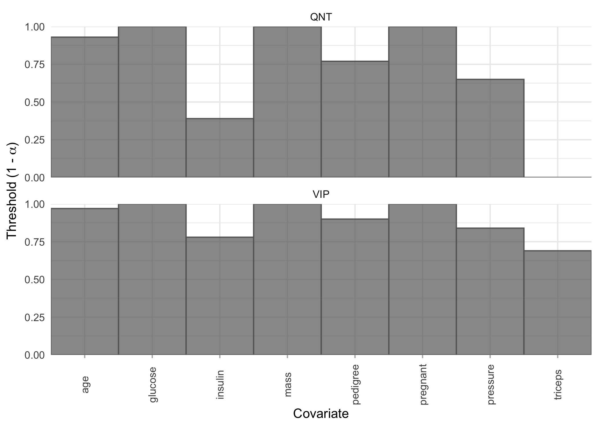
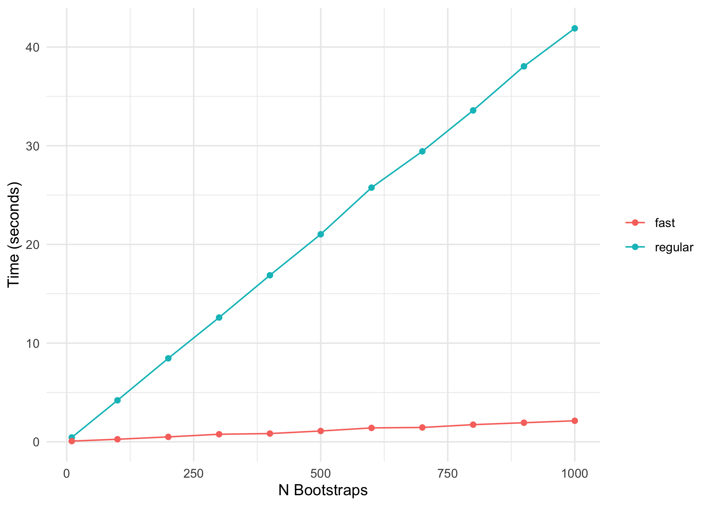

<!-- README.md is generated from README.Rmd. Please edit that file -->

# bolasso <a href='https://www.dmolitor.com/bolasso/'></a>

<!-- badges: start -->

[](https://github.com/dmolitor/bolasso/actions)
[](https://github.com/dmolitor/bolasso/actions)
[](https://app.codecov.io/gh/dmolitor/bolasso?branch=main)
[](https://CRAN.R-project.org/package=bolasso)
<!-- badges: end -->

The goal of bolasso is to implement bootstrap-enhanced Lasso (and more
generally, penalized regression) estimation, as proposed originally in
[Bach (2008)](#2) and extended by [Bunea et al. (2011)](#3) and [Abram
et al. (2016)](#1). These methods focus primarily on variable selection
and propose two similar, but slightly different, variable selection
algorithms; the variable inclusion probability (VIP) algorithm (Bach;
Bunea et al.), and the bootstrap distribution quantile (QNT) algorithm
(Abram et al.). Beyond implementing both these variable selection
methods, bolasso also provides utilities for making bagged predictions,
examining coefficient distributions, and plotting.

## Installation

Install bolasso from CRAN:

``` r
install.packages("bolasso")
```

Or install the development version from GitHub with:

``` r
# install.packages("pak")
pak::pkg_install("dmolitor/bolasso@dev")
```

## Usage

To illustrate the usage of bolasso, we’ll use the [Pima Indians Diabetes
dataset](http://math.furman.edu/~dcs/courses/math47/R/library/mlbench/html/PimaIndiansDiabetes.html)
to determine which factors are important predictors of testing positive
for diabetes. For a full description of the input variables, see the
link above.

### Load requisite packages and data

``` r
library(bolasso)
library(ggplot2)
library(tibble)

data(PimaIndiansDiabetes, package = "mlbench")

# Quick overview of the dataset
str(PimaIndiansDiabetes)
#> 'data.frame':    768 obs. of  9 variables:
#>  $ pregnant: num  6 1 8 1 0 5 3 10 2 8 ...
#>  $ glucose : num  148 85 183 89 137 116 78 115 197 125 ...
#>  $ pressure: num  72 66 64 66 40 74 50 0 70 96 ...
#>  $ triceps : num  35 29 0 23 35 0 32 0 45 0 ...
#>  $ insulin : num  0 0 0 94 168 0 88 0 543 0 ...
#>  $ mass    : num  33.6 26.6 23.3 28.1 43.1 25.6 31 35.3 30.5 0 ...
#>  $ pedigree: num  0.627 0.351 0.672 0.167 2.288 ...
#>  $ age     : num  50 31 32 21 33 30 26 29 53 54 ...
#>  $ diabetes: Factor w/ 2 levels "neg","pos": 2 1 2 1 2 1 2 1 2 2 ...
```

First, let’s create a train/test split of our data, and then run
100-fold bootstrapped Lasso with `glmnet`.

``` r
train_idx <- sample(1:nrow(PimaIndiansDiabetes), round(0.7*nrow(PimaIndiansDiabetes)))
train <- PimaIndiansDiabetes[train_idx, ]
test <- PimaIndiansDiabetes[-train_idx, ]

model <- bolasso(
  diabetes ~ .,
  data = train,
  n.boot = 100,
  progress = FALSE,
  family = "binomial"
)
#> Loaded glmnet 4.1-8
```

### Variable selection

Next, using a threshold of 0.95 we can extract the selected variables
using the VIP method, which extracts all variables that were selected
(had non-zero coefficients) in \>= 95% of the bootstrapped models. We’ll
use the regularization parameter `lambda.min` that minimizes
cross-validation error.

``` r
selected_variables(model, threshold = 0.95, method = "vip", select = "lambda.min")
#> # A tibble: 100 × 5
#>    id     pregnant glucose   mass    age
#>    <chr>     <dbl>   <dbl>  <dbl>  <dbl>
#>  1 boot1    0.117   0.0384 0.0800 0.0145
#>  2 boot2    0.112   0.0331 0.0675 0.0115
#>  3 boot3    0.143   0.0257 0.112  0.0135
#>  4 boot4    0.130   0.0240 0.0789 0.0240
#>  5 boot5    0.0473  0.0215 0.0793 0.0183
#>  6 boot6    0.0634  0.0247 0.0666 0.0346
#>  7 boot7    0.101   0.0326 0.0656 0.0194
#>  8 boot8    0.0761  0.0258 0.0937 0.0359
#>  9 boot9    0.202   0.0238 0.0613 0.0113
#> 10 boot10   0.0926  0.0337 0.0779 0.0293
#> # ℹ 90 more rows
```

Note that this returned a tibble with the selected variables as columns
and the coefficients for each of the bootstrapped models as rows. If you
want to simply return only the variable names, you can add the
`var_names_only` argument:

``` r
selected_variables(model, 0.95, "vip", var_names_only = TRUE)
#> [1] "pregnant" "glucose"  "mass"     "age"
```

We can compare the selected variables using the VIP method to the QNT
method, which selects all variables that have a 95% bootstrap confidence
interval that does not contain 0:

``` r
selected_variables(model, 0.95, "qnt", var_names_only = TRUE)
#> [1] "pregnant" "glucose"  "mass"
```

Note that the number of selected variables with QNT will always be \<=
than with VIP. The default method for bolasso is `method = "vip"`.

#### Variable selection thresholds

It may be that, instead of selecting variables for a given threshold and
method, we want to see the largest threshold at which each variable
would be selected by both the VIP and QNT methods. We can quickly
visualize this with the `plot_selection_thresholds` function.

``` r
plot_selection_thresholds(model, select = "lambda.min")
```



You can also get these thresholds in a tibble:

``` r
selection_thresholds(model, select = "lambda.min")
#> # A tibble: 16 × 5
#>    covariate method threshold  alpha covariate_id
#>    <chr>     <chr>      <dbl>  <dbl>        <int>
#>  1 age       QNT         0.93 0.0700            8
#>  2 glucose   QNT         1    0                 2
#>  3 insulin   QNT         0.39 0.61              5
#>  4 mass      QNT         1    0                 6
#>  5 pedigree  QNT         0.77 0.23              7
#>  6 pregnant  QNT         1    0                 1
#>  7 pressure  QNT         0.65 0.35              3
#>  8 triceps   QNT         0    1                 4
#>  9 age       VIP         0.97 0.0300            8
#> 10 glucose   VIP         1    0                 2
#> 11 insulin   VIP         0.78 0.22              5
#> 12 mass      VIP         1    0                 6
#> 13 pedigree  VIP         0.9  0.1               7
#> 14 pregnant  VIP         1    0                 1
#> 15 pressure  VIP         0.84 0.16              3
#> 16 triceps   VIP         0.69 0.31              4
```

### Coefficients

#### All coefficients

bolasso also supports moving beyond variable selection and understanding
the bootstrapped variable coefficients. We can extract a tidy tibble
where each variable is a column, and each row represents a bootstrap
fold, and the values are the corresponding estimated coefficients.

``` r
tidy(model, select = "lambda.min")
#> # A tibble: 100 × 10
#>    id     Intercept pregnant glucose pressure triceps   insulin   mass pedigree
#>    <chr>      <dbl>    <dbl>   <dbl>    <dbl>   <dbl>     <dbl>  <dbl>    <dbl>
#>  1 boot1      -8.80   0.117   0.0384 -0.00768 0.00459 -0.00313  0.0800  1.08   
#>  2 boot2      -7.26   0.112   0.0331 -0.00633 0.00873 -0.00246  0.0675  0.00375
#>  3 boot3      -7.17   0.143   0.0257 -0.0221  0.00815 -0.00262  0.112   0.717  
#>  4 boot4      -7.08   0.130   0.0240 -0.0133  0.00517  0        0.0789  0.716  
#>  5 boot5      -6.14   0.0473  0.0215 -0.00661 0.00237 -0.00173  0.0793  0.305  
#>  6 boot6      -7.92   0.0634  0.0247  0       0       -0.000142 0.0666  1.10   
#>  7 boot7      -6.88   0.101   0.0326 -0.0224  0.0129  -0.00100  0.0656  1.16   
#>  8 boot8      -7.93   0.0761  0.0258 -0.0141  0.0102  -0.00103  0.0937  0.471  
#>  9 boot9      -6.37   0.202   0.0238 -0.00875 0.0106  -0.000555 0.0613  0      
#> 10 boot10     -8.39   0.0926  0.0337 -0.0104  0.00500 -0.000949 0.0779  0.793  
#> # ℹ 90 more rows
#> # ℹ 1 more variable: age <dbl>
```

bolasso also allows us to plot the bootstrap distribution of variable
coefficients. Suppose that we want to quickly inspect this distribution
for each of our variables. We can achieve this by simply plotting our
model.

``` r
plot(model, select = "lambda.min")
```


Now, suppose for example we are particularly interested in the
coefficient distributions for the `triceps`, `pressure`, and `glucose`
variables. We can plot the distributions for just these variables:

``` r
plot(model, covariates = c(glucose, pressure, triceps))
```


Note: If there are more than 30 variables included in our model, then
this will plot the 30 variables with the largest absolute mean
coefficients.

#### Selected variable coefficients

If we want to plot the coefficient distributions for only the selected
variables, we can use `plot_selected_variables` which will give us
pretty much the same thing as `plot`.

``` r
plot_selected_variables(
  model,
  threshold = 0.95,
  method = "vip",
  select = "lambda.min"
)
```


Just like `plot` we can also focus on a subset of our selected
variables.

``` r
plot_selected_variables(
  model,
  covariates = c(pregnant, mass),
  threshold = 0.95,
  method = "vip",
  select = "lambda.min"
)
```


### Predictions

Finally, we can make predictions using our bolasso model on new data.
For example, the following code shows how we would generate predicted
probabilites on our `test` data.

``` r
as_tibble(predict(model, test, select = "lambda.min", type = "response"))
#> # A tibble: 230 × 100
#>    boot1 boot2 boot3 boot4 boot5 boot6 boot7 boot8 boot9 boot10 boot11 boot12
#>    <dbl> <dbl> <dbl> <dbl> <dbl> <dbl> <dbl> <dbl> <dbl>  <dbl>  <dbl>  <dbl>
#>  1 0.784 0.732 0.747 0.687 0.669 0.684 0.783 0.717 0.675  0.763  0.643  0.768
#>  2 0.239 0.295 0.260 0.212 0.353 0.232 0.156 0.199 0.249  0.215  0.268  0.161
#>  3 0.644 0.600 0.482 0.595 0.523 0.646 0.700 0.566 0.555  0.696  0.581  0.661
#>  4 0.321 0.316 0.633 0.431 0.367 0.203 0.558 0.349 0.407  0.331  0.369  0.376
#>  5 0.239 0.259 0.283 0.253 0.335 0.262 0.308 0.265 0.215  0.264  0.242  0.285
#>  6 0.370 0.362 0.389 0.410 0.413 0.419 0.441 0.371 0.373  0.407  0.357  0.367
#>  7 0.958 0.931 0.903 0.858 0.865 0.873 0.893 0.860 0.861  0.931  0.874  0.862
#>  8 0.355 0.445 0.385 0.320 0.334 0.234 0.338 0.257 0.514  0.294  0.352  0.272
#>  9 0.427 0.517 0.508 0.505 0.426 0.378 0.480 0.426 0.644  0.460  0.481  0.393
#> 10 0.465 0.446 0.536 0.500 0.532 0.541 0.496 0.564 0.435  0.526  0.432  0.567
#> # ℹ 220 more rows
#> # ℹ 88 more variables: boot13 <dbl>, boot14 <dbl>, boot15 <dbl>, boot16 <dbl>,
#> #   boot17 <dbl>, boot18 <dbl>, boot19 <dbl>, boot20 <dbl>, boot21 <dbl>,
#> #   boot22 <dbl>, boot23 <dbl>, boot24 <dbl>, boot25 <dbl>, boot26 <dbl>,
#> #   boot27 <dbl>, boot28 <dbl>, boot29 <dbl>, boot30 <dbl>, boot31 <dbl>,
#> #   boot32 <dbl>, boot33 <dbl>, boot34 <dbl>, boot35 <dbl>, boot36 <dbl>,
#> #   boot37 <dbl>, boot38 <dbl>, boot39 <dbl>, boot40 <dbl>, boot41 <dbl>, …
```

Note that this outputs an (n x p) matrix of predictions where n is the
number of rows in our test set, p is the number of bootstraps, and each
column represents the predictions from one of our bootstrapped models.
To combine these into a single prediction per observation, we could take
the average for each observation across the models:

``` r
tibble(
  predictions = rowMeans(
    predict(model, test, select = "lambda.min", type = "response")
  )
)
#> # A tibble: 230 × 1
#>    predictions
#>          <dbl>
#>  1       0.704
#>  2       0.254
#>  3       0.637
#>  4       0.372
#>  5       0.268
#>  6       0.395
#>  7       0.906
#>  8       0.328
#>  9       0.465
#> 10       0.470
#> # ℹ 220 more rows
```

### Fast estimation 🏎️💨

For each bootstrapped model, bolasso uses cross-validation to find the
optimal regularization parameter lambda. In glmnet, the default number
of cross-validation folds is 10. This can quickly become computationally
expensive and slow, especially when using many bootstrap replicates. For
example, with 1,000 bootstrap replicates, this results in estimating
models on 10,000 cross-validation sets.

To address this, we can activate the `fast = TRUE` argument in bolasso.
Instead of using cross-validation to find the optimal lambda for each
bootstrap model, fast bolasso runs a single cross-validated regression
on the full dataset to identify the optimal lambda. Then each
bootstrapped model uses that lambda as its regularization parameter.

The following comparison shows the computation time of standard bolasso
vs fast bolasso across increasing bootstrap replicates. The plot
displays the number of seconds each algorithm takes to complete.

``` r
# Compare standard vs. fast bolasso across different bootstrap values
times <- lapply(
  c(10, 100, 200, 300, 400, 500, 600, 700, 800, 900, 1e3),
  \(x) {
    time_standard <- system.time({
      bolasso(
        diabetes ~ .,
        data = train,
        n.boot = x,
        progress = FALSE,
        family = "binomial"
      )
    })
    time_fast <- system.time({
      bolasso(
        diabetes ~ .,
        data = train,
        n.boot = x,
        progress = FALSE,
        family = "binomial",
        fast = TRUE
      )
    })
    return(
      tibble::tibble("regular" = time_standard[[3]], "fast" = time_fast[[3]])
    )
  }
)

# Make a data.frame out of the times
times_df <- do.call(rbind, times) |>
  transform(
    id = 1:11,
    n_bootstrap = c(10, 100, 200, 300, 400, 500, 600, 700, 800, 900, 1e3)
  ) |>
  reshape(
    varying = c("regular", "fast"),
    v.names = "time",
    times = c("regular", "fast"),
    timevar = "algorithm",
    idvar = c("id", "n_bootstrap"),
    direction = "long"
  )

# Plot it!
ggplot(times_df, aes(x = n_bootstrap, y = time, color = factor(algorithm))) +
  geom_point() +
  geom_line() +
  labs(x = "N Bootstraps", y = "Time (seconds)") +
  scale_y_continuous(breaks = seq(0, 60, 10)) +
  theme_minimal() +
  theme(legend.title = element_blank())
```



Fast bolasso clearly achieves some pretty massive speedups over the
standard version! This difference in speed will only be more accentuated
when estimating on larger datasets.

#### What do we lose with standard vs. fast?

There’s never a free lunch, so to be clear about the tradeoffs between
the standard and fast versions of bolasso, the following shows the
difference in predictive accuracy on our hold-out test set.

``` r
model_standard <- bolasso(
  diabetes ~ .,
  data = train,
  n.boot = 100,
  progress = FALSE,
  family = "binomial"
)
model_fast <- bolasso(
  diabetes ~ .,
  data = train,
  n.boot = 100,
  progress = FALSE,
  family = "binomial",
  fast = TRUE
)

model_standard_preds <- ifelse(
  rowMeans(predict(model_standard, test, type = "response")) >= 0.5,
  yes = 1,
  no = 0
)
model_fast_preds <- ifelse(
  rowMeans(predict(model_fast, test, type = "response")) >= 0.5,
  yes = 1,
  no = 0
)
truth <- as.integer(test$diabetes) - 1
```

    #> Standard Bolasso accuracy: 80.87 %
    #>  Fast Bolasso accuracy: 80.43 %

It’s important to note that fast bolasso should be thought of more as a
rough-and-ready algorithm that is better for quick iteration and might
have worse empirical performance than the standard algorithm.

#### Parallelizing bolasso

We can also fit bolasso bootstrap models in parallel via the
[future](https://CRAN.R-project.org/package=future) package. The future
package supports a wide variety of parallelization, from local
multi-core to remote compute clusters. Parallelizing bolasso is as
simple as initializing the parallel method prior to executing the
bolasso function. For example, the following setup will execute bolasso
in parallel R sessions.

``` r
future::plan("multisession")
time_parallel <- system.time({
  bolasso(
    diabetes ~ .,
    data = train,
    n.boot = 1000,
    progress = FALSE,
    family = "binomial"
  )
})
future::plan("sequential")

time_sequential <- system.time({
  bolasso(
    diabetes ~ .,
    data = train,
    n.boot = 1000,
    progress = FALSE,
    family = "binomial"
  )
})
```

    #> Parallel bolasso time (seconds): 10.699 
    #> Sequential bolasso time (seconds): 41.497

### Beyond the Lasso

bolasso also allows us to fit penalized regression models beyond the
Lasso. For example, suppose we want to fit a bootstrap-enhanced
elasticnet model with a mixing parameter of 0.5 (an even mix of the
Ridge and Lasso regularization terms). We can simply pass the underlying
`glmnet::glmnet` argument `alpha = 0.5` through bolasso. The following
code compares selected variables between the Lasso and elasticnet
models.

``` r
lasso <- bolasso(
  diabetes ~ .,
  data = train,
  n.boot = 100,
  progress = FALSE,
  family = "binomial"
)

elnet <- bolasso(
  diabetes ~ .,
  data = train,
  n.boot = 100,
  progress = FALSE,
  family = "binomial",
  alpha = 0.5
)
```

    #> Lasso selected variables: pregnant glucose mass age 
    #> Elnet selected variables: pregnant glucose mass pedigree age

## References

<a id="1">\[1\]</a>Abram, Samantha V et al. “Bootstrap Enhanced
Penalized Regression for Variable Selection with Neuroimaging Data.”
Frontiers in neuroscience vol. 10 344. 28 Jul. 2016,
<doi:10.3389/fnins.2016.00344>

<a id="2">\[2\]</a>Bach, Francis. “Bolasso: Model Consistent Lasso
Estimation through the Bootstrap.” ArXiv:0804.1302 \[Cs, Math, Stat\],
2008. <https://arxiv.org/abs/0804.1302>.

<a id="3">\[3\]</a>Bunea, Florentina et al. “Penalized least squares
regression methods and applications to neuroimaging.” NeuroImage
vol. 55,4 (2011): 1519-27. <doi:10.1016/j.neuroimage.2010.12.028>
